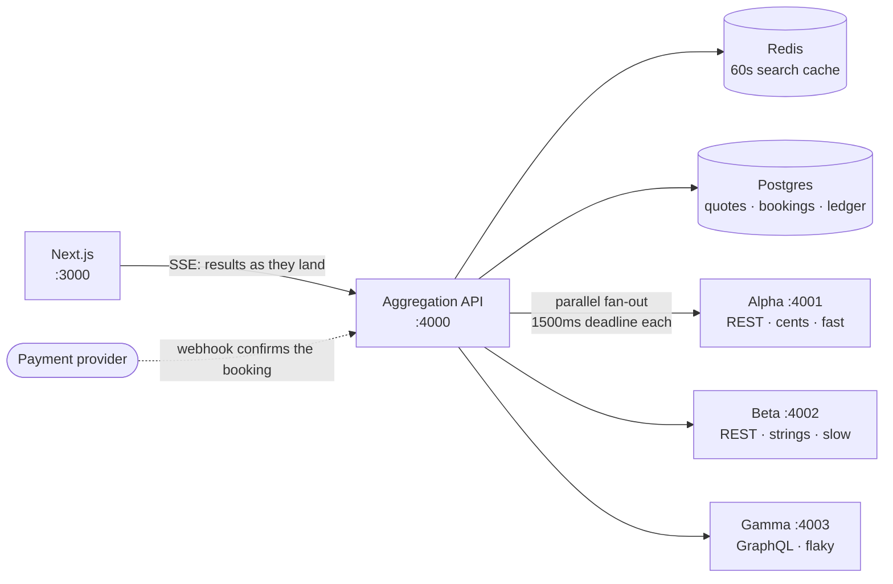
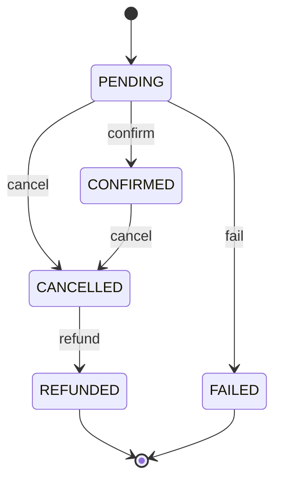

# StayFinder

**Live demo:** _(link placeholder)_

An online travel agency owns no inventory — it has to ask suppliers, and every
supplier speaks a different dialect, answers at a different speed, and
occasionally changes the price between showing it to you and taking your money.
StayFinder is a miniature booking engine that fans one search out to three
deliberately incompatible suppliers in parallel, normalizes their answers into a
single model, and streams results back as each one lands — without letting a slow
or broken supplier break the page. It then walks a booking through quote
revalidation, webhook-driven payment, and a strictly enforced state machine
backed by an append-only ledger.

Everything runs locally against seeded data. There is nothing to sign up for.

```bash
git clone https://github.com/shahidmonowarr/StayFinder.git stayfinder && cd stayfinder
cp .env.example .env
docker compose up -d
npm install && npm run db:deploy
npm run dev
```

Then open **http://localhost:3000**, which starts searching immediately.

---

## Architecture



The three suppliers are separate processes, not in-process fakes. That is what
makes the timeouts, partial failures, and streaming real rather than simulated.

| Supplier | Protocol           | Price format                | Personality               |
| -------- | ------------------ | --------------------------- | ------------------------- |
| Alpha    | REST, `camelCase`  | integer cents, per night    | fast (~100ms), reliable   |
| Beta     | REST, `snake_case` | decimal strings, whole stay | slow (800–2000ms)         |
| Gamma    | GraphQL, nested    | nested object, per night    | 20% 500s, 10% price drift |

---

## The four things worth looking at

**1. The fan-out.** Three concurrent legs, a hard 1500ms deadline each,
implemented with `AbortSignal.timeout` passed into `fetch` — not a `Promise.race`
against a timer, which leaves the losing socket open and streaming. A failed leg
contributes a status and zero options; it can never reject the search. Every
response is `200`, because one supplier being down is not our error.
→ [`fanout.ts`](apps/api/src/orchestrator/fanout.ts)

**2. Normalization and dedup.** Alpha quotes per night in cents, Beta quotes the
whole stay as a decimal string, Gamma buries a nested object two levels down.
They all become one `HotelOption` with both price bases populated. There is no
shared key between suppliers, so the same building has to be _recognized_ — by
normalizing case, punctuation, diacritics and whitespace across "Grand Meridian
Lisbon", "Grand Meridian, Lisbon" and "GRAND MERIDIAN LISBON".
→ [`adapters/`](apps/api/src/adapters) · [`dedupe.ts`](packages/shared/src/dedupe.ts)

**3. Money.** Integer minor units throughout. Beta's decimal strings are parsed
by string surgery rather than `parseFloat`, because `0.29 * 100` is
`28.999999999999996`. Where a stay total will not divide evenly across nights,
the nightly rate is display-grade and the stay total stays authoritative — the
ledger records what the supplier actually quoted.
→ [`money.ts`](packages/shared/src/money.ts)

**4. The booking state machine.** Pure: no database, no payment client, no clock,
no I/O. Illegal transitions throw. Tested across the complete state × transition
matrix so a future edit cannot quietly widen it.
→ [`booking-state-machine.ts`](packages/shared/src/booking-state-machine.ts)



Two omissions are deliberate. There is no `CONFIRMED → REFUNDED`: refunding a
live booking leaves the guest holding both their money and their room. And
nothing leaves `FAILED` — a failed payment does not quietly become a paid booking
later.

---

## Chaos mode

The demo page has a chaos toggle. Every control forces a **real** code path — the
header reaches the actual Gamma process, which actually fails; the duplicate
webhook is a real signed delivery through the real endpoint. Nothing is simulated
in the UI, because a mocked failure would prove nothing.

| Force                     | What you watch happen                                                                                      |
| ------------------------- | ---------------------------------------------------------------------------------------------------------- |
| **Break SupplierGamma**   | The strip shows `error`. Results still arrive from the other two. Still `200`.                             |
| **Move the price**        | Re-quoting returns `PRICE_CHANGED` with both amounts, and booking is blocked until you accept the new one. |
| **Redeliver the webhook** | `processed`, then `duplicate` forever. One charge in the ledger, not two.                                  |

The same things from a terminal:

```bash
curl -N "localhost:4000/api/search/stream?destination=Lisbon&checkIn=2026-09-01&checkOut=2026-09-04&guests=2"
```

```
[    0ms] meta   cached=false suppliers=[alpha, beta, gamma]
[   85ms] leg    alpha  ok         122ms  3 options
[  312ms] leg    gamma  ok         336ms  2 options
[ 1478ms] leg    beta   timeout   1503ms  0 options
[ 1478ms] done   elapsed=1517ms
```

Beta is both the slowest supplier and the one holding the best price on the
property all three sell — which is why results stream and re-sort rather than
being sorted once at the end.

And the ledger cannot be rewritten, by anyone:

```bash
docker compose exec postgres psql -U stayfinder -d stayfinder -c 'UPDATE transactions SET "amountMinor" = 1;'
```

```
ERROR:  transactions is append-only: UPDATE is not permitted.
        A refund is a new row, not an edit.
```

More transcripts, wire formats, and the reasoning behind each decision are in
**[docs/architecture.md](docs/architecture.md)**.

---

## Design decisions

**Why a 1500ms per-supplier deadline.** Beta's latency ranges to 2000ms, so the
deadline sits deliberately _inside_ its distribution. A search that waits for
everyone is as slow as the worst one; a search that gives up early throws away
inventory. At 1500ms the response stays fast and Beta usually — but not always —
makes it, so the timeout path is exercised in ordinary use rather than only in
tests.

**Why results stream.** Alpha answers in ~100ms and Beta can take twenty times
that. Buffering hands the user a blank page for the duration of the slowest
supplier. Partial results shown honestly beat complete results shown late.

**Why per-supplier status is in the response contract.** A search where one
supplier failed is valid but not complete. Making `suppliers[]` part of the
payload rather than a debug field means the UI cannot present a degraded result
set as if it were the whole market.

**Why money is an integer.** Minor units everywhere, decimal strings parsed by
hand. A booking engine that loses a cent per search loses trust faster than it
loses money.

**Why a quote fails where a search degrades.** Partial inventory is useful; a
partial answer to "what will this cost" is not. Same codebase, opposite failure
policies, on purpose.

**Why quotes live in Postgres rather than Redis.** A quote lasts five minutes,
which argues for a cache — but it is the provenance of an amount about to be
charged, and evicting that under memory pressure is not a trade worth making.

**Why partial results are never cached.** A 60s entry holding a response where
one supplier failed would serve that degraded result to everyone for a minute.
Re-running costs one fan-out.

**Why idempotency is a unique index, not a lookup.** Read-then-insert races. The
constraint is the guarantee. The subtlety that cost real debugging: a replayed
request violates _two_ constraints and Postgres names whichever it checked first,
so the recovery path has to ask "did this key already produce a booking?" rather
than trusting the reported column.

**Why confirmation is webhook-driven.** A redirect can be closed, blocked, or
lost; the webhook is the only delivery a provider retries. The browser is not
permitted to decide whether a booking is paid for.

**Why duplicate webhooks need two defences.** The same event twice is caught by a
primary key on the provider's event id. A _different_ event repeating a
transition already made slips past that entirely — the state machine catches it,
as a deliberate no-op rather than a swallowed exception.

**Why the ledger is append-only.** A refund is a new row, never an edit to the
charge it reverses. Payment state that can be overwritten cannot be audited. It
is enforced by a Postgres trigger rather than a comment, because a comment is not
enforcement.

---

## Running it

```bash
npm run dev        # web :3000, API :4000, suppliers :4001–:4003
npm run verify     # format + lint + typecheck + test — what CI runs
npm run build      # production build of every workspace
```

**436 tests.** The orchestrator, the state machine, money, dedup, and idempotency
are covered heaviest; supplier contract tests assert each supplier keeps speaking
its own awkward dialect, so a refactor cannot quietly make them agree.

Redis is optional — without `REDIS_URL` the API falls back to an in-memory cache.
Postgres is not: a booking has to survive a restart, so the quote and booking
routes return `503` without a `DATABASE_URL` rather than pretending to work.

Postgres is published on **5433**, not 5432, so a Postgres already installed on
the host cannot silently shadow the container.

## Known gaps

- **The Stripe adapter is unverified.** Payments run against a fake provider that
  implements the same HMAC signature scheme, so signature checks, replay
  rejection, and raw-body handling are genuinely exercised. The Stripe adapter's
  event mapping is unit-tested against captured payload shapes, but its network
  calls have never run against the live API. Closing that gap needs
  `STRIPE_SECRET_KEY` in `.env` and
  `stripe listen --forward-to localhost:4000/api/webhooks/stripe`.
- Property identity is inferred from normalized names. A real OTA uses a curated
  property-mapping table; two genuinely different hotels sharing a name in one
  city would collide here.
- Single currency by design.

## Tech

TypeScript throughout. Next.js (App Router) + Tailwind, Express, Postgres +
Prisma, Redis, Vitest, Turborepo, GitHub Actions.
