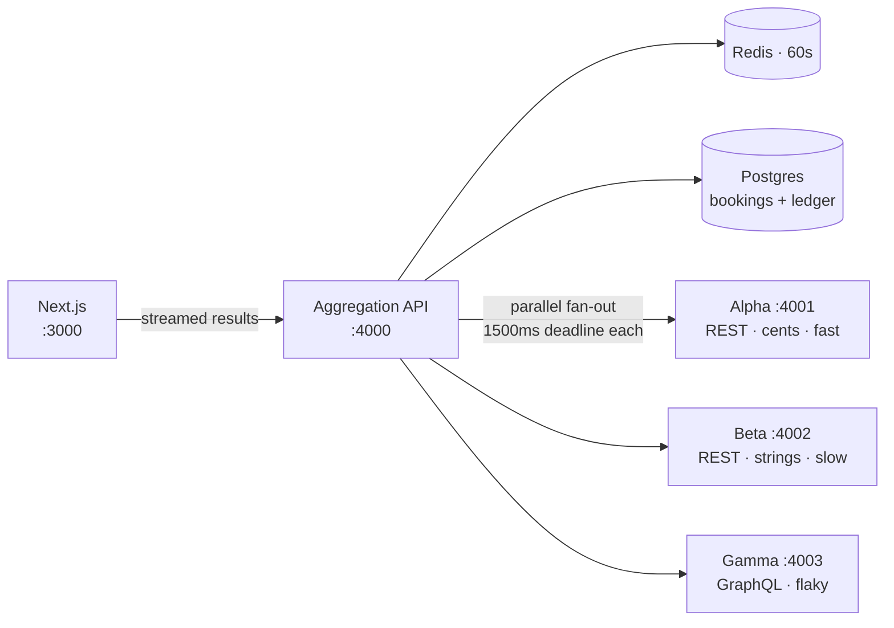

# StayFinder

**Live demo:** _(link placeholder — added in M7)_

An online travel agency owns no inventory: it has to ask suppliers, and every
supplier speaks a different dialect, answers at a different speed, and
occasionally lies about the price. StayFinder is a miniature booking engine that
fans a single search out to three deliberately incompatible hotel suppliers in
parallel, normalizes their responses into one model, and streams results back as
each one answers — without letting a slow or broken supplier break the page. It
then walks a booking through quote revalidation, payment, and a strictly
enforced state machine backed by an append-only ledger.

---

## Architecture



The three suppliers are real separate processes, not in-process fakes — that is
what makes the timeout, partial-failure, and streaming behaviour genuine rather
than simulated. Full detail in [`docs/architecture.md`](docs/architecture.md).

| Supplier | Protocol           | Price format                | Personality               |
| -------- | ------------------ | --------------------------- | ------------------------- |
| Alpha    | REST, `camelCase`  | integer cents, per night    | fast (~100ms), reliable   |
| Beta     | REST, `snake_case` | decimal strings, stay total | slow (800–2000ms)         |
| Gamma    | GraphQL, nested    | nested object, per night    | 20% 500s, 10% price drift |

---

## Local setup

```bash
git clone <repo-url> stayfinder && cd stayfinder
cp .env.example .env
docker compose up -d          # Postgres on 5433, Redis on 6379
npm install
npm run db:deploy -w @stayfinder/api && npm run dev
```

That brings up the web app on `:3000`, the API on `:4000`, and the three
suppliers on `:4001`–`:4003`.

Useful scripts:

```bash
npm run verify    # format check + lint + typecheck + test — what CI runs
npm run test      # Vitest across every workspace
npm run build     # production build of every workspace
```

Redis is optional: with `REDIS_URL` unset the API falls back to an in-memory
cache so the demo runs on a laptop with nothing installed. Postgres is not —
bookings have to survive a restart, so `/api/quote` and `/api/bookings` return
`503` without a `DATABASE_URL` rather than pretending to work.

The container publishes Postgres on **5433**, not 5432. A Postgres already
installed on the host holding the default port is common enough that colliding
with it would make `docker compose up -d` appear to work while every connection
went to the wrong database.

---

## See the problem for yourself

With `npm run dev` running, ask all three suppliers about the same hotel for the
same three nights. Every one of them describes it differently.

```bash
curl -s "localhost:4001/hotels?destination=Lisbon&checkIn=2026-09-01&checkOut=2026-09-04&guests=2" | jq '.hotels[0]'
```

```bash
curl -s "localhost:4002/v1/availability?destination_code=LIS&check_in_date=2026-09-01&check_out_date=2026-09-04&occupancy=2" | jq '.results[0]'
```

```bash
curl -s localhost:4003/graphql -H 'content-type: application/json' -d '{"query":"{searchHotels(input:{destination:\"Lisbon\",checkIn:\"2026-09-01\",checkOut:\"2026-09-04\",guests:2}){edges{node{id property{name rating{stars}} pricing{perNight{amount currency{code}} refundable}}}}}"}' | jq '.data.searchHotels.edges[0].node'
```

If that third one returns a `500`, run it again — you have just met Gamma, and
absorbing that is the aggregator's job.

`ALPHA-1042` / `bt_88` / `gamma:hotel:7` are the same building. Alpha calls it
"Grand Meridian Lisbon" at `12990` cents a night, Beta calls it "Grand Meridian,
Lisbon" at `"375.00"` for the stay, Gamma shouts "GRAND MERIDIAN LISBON" at
`13500` a night buried under `pricing.perNight.amount` — and Alpha and Gamma
disagree about whether it is refundable. There is no shared key to join on.

Gamma also fails one request in five. Force its behaviour with a header:

```bash
curl -s -o /dev/null -w '%{http_code}\n' localhost:4003/graphql -H 'content-type: application/json' -H 'x-chaos: fail' -d '{"query":"{searchHotels(input:{destination:\"Lisbon\",checkIn:\"2026-09-01\",checkOut:\"2026-09-04\"}){totalCount}}"}'
```

`x-chaos: drift` makes a quote come back at a price search never advertised,
`x-chaos: none` makes Gamma behave. This is what the M7 chaos-mode toggle drives.

---

## Now watch the aggregator absorb it

```bash
curl -s "localhost:4000/api/search?destination=Lisbon&checkIn=2026-09-01&checkOut=2026-09-04&guests=2" | jq '{count: (.options|length), suppliers: [.suppliers[] | "\(.supplier):\(.status) \(.latencyMs)ms ×\(.resultCount)"]}'
```

Run it a few times. Eight consecutive live searches, nothing staged:

```
7 options  alpha:ok(123ms,3)  beta:ok(935ms,2)       gamma:ok(329ms,2)
5 options  alpha:ok(104ms,3)  beta:ok(1460ms,2)      gamma:error(306ms,0)
7 options  alpha:ok(105ms,3)  beta:ok(1298ms,2)      gamma:ok(308ms,2)
5 options  alpha:ok(103ms,3)  beta:timeout(1505ms,0) gamma:ok(308ms,2)
```

Every one of those returned **HTTP 200**. A supplier that times out or 500s
contributes a status and zero options; it cannot fail the request, and it cannot
delay the suppliers that are healthy.

Take a supplier away entirely and search again:

```bash
kill $(lsof -ti tcp:4001 -sTCP:LISTEN)
```

```
alpha  error       16ms  fetch failed: connect ECONNREFUSED ::1:4001
beta   ok         961ms
gamma  ok         320ms
-> HTTP 200, 5 options from the survivors
```

The `-sTCP:LISTEN` matters: without it `lsof` also lists the API's _client_
socket to port 4001 and you may kill the aggregator instead of the supplier.

The seven options collapse into four buildings. Beta — the slowest supplier —
holds the best price on the one all three sell.

---

## Watch it stream

Open **http://localhost:3000**. The page searches on load: Alpha's rates appear
in ~100ms against skeleton cards, Gamma fills in around 300ms, and Beta arrives
a second later — often re-sorting the list, because it holds the cheapest room on
the property all three sell. The status strip above the results shows each
supplier's state as it happens.

The same stream from a terminal:

```bash
curl -N "localhost:4000/api/search/stream?destination=Lisbon&checkIn=2026-09-01&checkOut=2026-09-04&guests=2"
```

```
[    0ms] meta   cached=false suppliers=[alpha, beta, gamma]
[   85ms] leg    alpha  ok         122ms  3 options
[  312ms] leg    gamma  ok         336ms  2 options
[ 1478ms] leg    beta   timeout   1503ms  0 options
[ 1478ms] done   elapsed=1517ms
```

Search the same thing twice and the second one comes back `cached=true` with
everything at 0ms — but only if all three suppliers succeeded the first time. A
result set with a timeout in it is deliberately not cached.

---

## Then watch it refuse to book at the wrong price

Click **Check price** on any result. The API re-asks that supplier what the room
costs right now — and SupplierGamma moves the price on roughly one quote in ten:

```
previousTotal: 40500      (what the card showed)
live total   : 42513      (what the supplier now says)
status       : PRICE_CHANGED
```

The UI stops there and shows both numbers. Continuing takes a second, deliberate
click on **Accept €425.13 and book**. Booking then creates a `PENDING` booking
against the _server's_ quote record — never a figure the browser sent back.

Replay protection, from a terminal:

```bash
curl -s -X POST localhost:4000/api/bookings -H 'content-type: application/json' -H 'Idempotency-Key: demo-1' -d '{"quoteId":"<id>","guestName":"Ada Lovelace","guestEmail":"ada@example.com"}'
```

```
1st call  → 201  created: true
2nd call  → 200  created: false, same booking id      (a double-click)
same key, different guest → 409 IDEMPOTENCY_KEY_REUSED
different key, same quote → 409 QUOTE_ALREADY_BOOKED
```

And the contrast that defines the quote path — with SupplierAlpha's process
killed:

```
POST /api/quote  → 502  SUPPLIER_UNAVAILABLE
GET  /api/search → 200  5 options from the survivors
```

Search degrades honestly. A quote does not degrade at all, because there is no
useful approximation of what something costs.

---

## Design decisions

**Why a 1500ms per-supplier timeout.** Beta's latency ranges to 2000ms, so the
deadline sits deliberately below its ceiling. A search that waits for every
supplier is as slow as the worst one; a search that gives up too early throws
away good inventory. 1500ms is the point where the response is still
perceptibly fast and Beta usually — but not always — makes it, which means the
timeout path is exercised in normal use instead of only in tests.

**Why results stream.** Alpha answers in ~100ms and Beta can take twenty times
that. Buffering until every supplier resolves would hand the user a blank page
for the duration of the slowest one, so results are pushed as each supplier
lands and the supplier-status strip shows what is still outstanding. Partial
results shown honestly beat complete results shown late.

**Why per-supplier status is in the response contract.** A search where one
supplier failed is still a valid search, but it is not a complete one. Making
`suppliers[]` part of the payload rather than a debug field means the UI cannot
accidentally present a degraded result set as if it were the whole market.

**Why money is an integer.** Prices are stored in minor units and decimal
strings are parsed by string surgery, not `parseFloat` — `0.29 * 100` is
`28.999999999999996` in IEEE-754. Where a stay total will not divide evenly
across nights, the nightly rate is treated as display-grade and the stay total
stays authoritative, so the amount charged is always the amount the supplier
actually quoted.

**Why partial results are never cached.** A 60s cache entry holding a response
where one supplier failed would serve that degraded result to every visitor for
the next minute. Re-running a fan-out costs one round of supplier calls; sticky
partial failure costs a minute of prices that are wrong in a way nobody can see.
So the cache only stores a response where all three suppliers reported `ok`.

**Why a cache can never break a search.** Both cache backends are wrapped so a
failed read reads as a miss and a failed write is dropped, logged either way.
Redis falling over should cost latency, not correctness — and keeping that
guarantee in one wrapper means it is tested once rather than in each backend.

**Why the ledger is append-only.** A refund is a new row, never an update to
the row it reverses. Payment state that can be overwritten cannot be audited,
and duplicate webhook deliveries — which Stripe makes no promise to avoid —
become dangerous the moment handling one means mutating a balance. Appending
makes replay safe by construction and lets a booking's financial history be
reconstructed from the ledger alone.

**Why a quote fails where a search degrades.** A search missing one supplier is
still useful — partial inventory beats no inventory, and the status strip says
what is missing. A quote has no partial answer: booking at a price nobody
confirmed is worse than not booking. So the same codebase runs opposite failure
policies on purpose, and the 502 is a 502 rather than a 500 because nothing is
wrong on our side.

**Why quotes live in Postgres rather than Redis.** A quote lives five minutes,
which argues for a cache. But it is also the provenance of an amount about to be
charged, and evicting that under memory pressure is not a trade worth making on
the money path.

**Why idempotency is a unique index rather than a lookup.** Read-then-insert
races: two concurrent requests both see no existing key and both insert. The
constraint is the guarantee. The subtlety that cost real debugging: a replayed
request violates _two_ constraints at once, and Postgres names whichever it
checked first — so the recovery path has to ask "did this key already produce a
booking?" rather than trusting which column was reported.

**Why the booking state machine is a pure module.** No I/O, no database calls,
no Stripe client. Illegal transitions throw. That keeps the rules exhaustively
testable in isolation, which is what makes it credible that money-handling code
does the right thing under duplicate webhooks and races.

---

## Milestones

- [x] **M1** — monorepo scaffold, shared model, CI
- [x] **M2** — three mock suppliers + seeded inventory
- [x] **M3** — `/api/search` fan-out, timeouts, normalization
- [x] **M4** — SSE streaming, Redis cache, supplier-status UI
- [x] **M5** — quote revalidation, booking state machine, tests
- [ ] **M6** — Stripe webhooks, idempotency, append-only ledger
- [ ] **M7** — chaos mode, polish, full README

## Tech

TypeScript throughout. Next.js (App Router) + Tailwind, Express, Postgres +
Prisma, Redis, Vitest, Turborepo, GitHub Actions.
