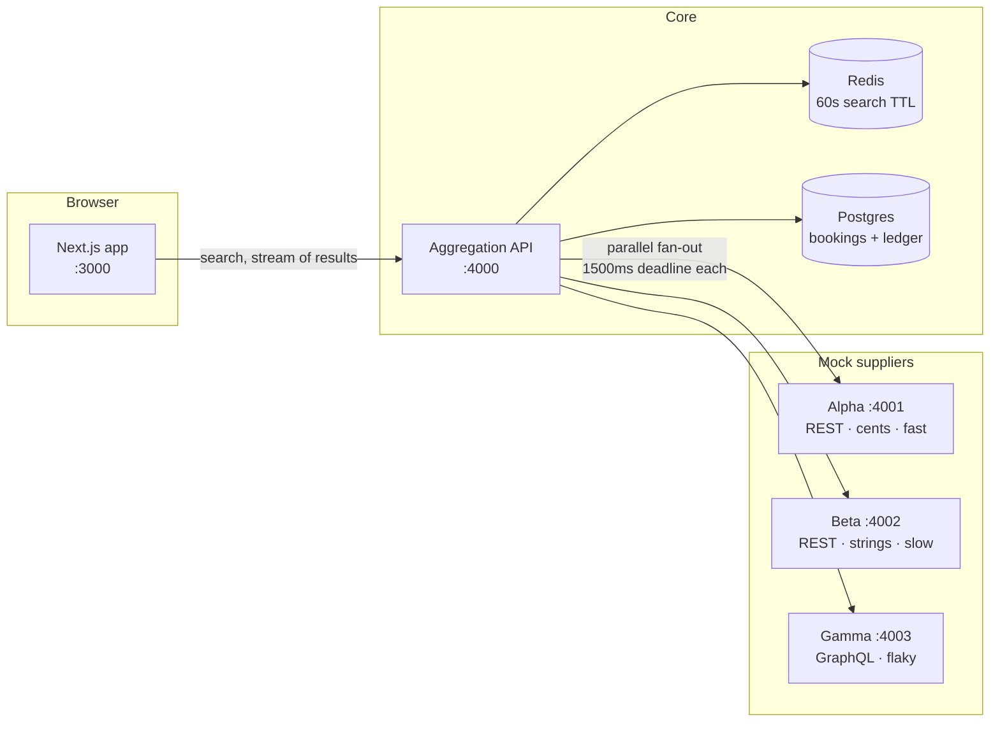

# Architecture

This document is written as the system is built. Sections marked _(planned)_
describe a milestone that has not landed yet; everything else describes code
that exists in the repo today.

---

## The problem

An OTA does not own inventory. It asks suppliers, and suppliers are
heterogeneous, slow, and unreliable in ways the user must never see. Three
concrete problems follow from that:

1. **Shape mismatch.** Every supplier returns a different JSON structure, a
   different casing convention, and a different idea of what "price" means.
2. **Latency and failure spread.** The slowest supplier decides how slow the
   page is, unless the design refuses to let it.
3. **Price drift.** The price a supplier advertises in search is not
   necessarily the price it will honour at booking time.

StayFinder is a miniature, fully local system that solves those three problems
and nothing else.

---

## Service topology



The three suppliers are separate processes on separate ports, not in-process
fakes. That distinction matters: a real network hop is what makes timeouts,
partial failure, and streaming behave like the production problem instead of a
simulation of it.

---

## The unified model

Every supplier response is normalized into `HotelOption` inside its supplier
adapter, and nothing downstream of the adapters may branch on `supplier` to
interpret a price. The type lives in
[`packages/shared/src/hotel-option.ts`](../packages/shared/src/hotel-option.ts).

| Field                           | Notes                                                                 |
| ------------------------------- | --------------------------------------------------------------------- |
| `id`                            | `${supplier}:${supplierHotelId}`, unique across the merged result set |
| `supplier`, `supplierHotelId`   | Who sold it and their own key — required to re-quote later            |
| `name`, `city`, `starRating`    | Display fields; `starRating` is `0` when the supplier does not rate   |
| `nightlyRate`, `totalPrice`     | **Both always populated**, whichever basis the supplier quoted in     |
| `checkIn`, `checkOut`, `nights` | `checkOut` is exclusive — the checkout day is not a night             |
| `guests`, `refundable`          | Echoed from the query / supplier                                      |
| `dedupeKey`                     | Identity of the physical hotel, independent of who is selling it      |

### Why both price bases are always present

Alpha quotes per night. Beta quotes stay totals. Gamma quotes per night inside
a nested object. If the model stored "the price the supplier gave us" plus a
basis flag, every consumer — sorting, dedup, the price-change check, the
checkout summary — would have to re-derive the other basis, and each of them
would round slightly differently. Normalizing both directions once, in
[`money.ts`](../packages/shared/src/money.ts), makes a rounding bug a single-file
problem.

### Why money is an integer

Prices are integer minor units (`12990` is €129.90), never floats. Beta sends
decimal strings, which are parsed by string surgery rather than `parseFloat`,
because `0.29 * 100` is `28.999999999999996` in IEEE-754 and a booking engine
that loses a cent per search loses trust faster than it loses money.

Where a derived value cannot divide evenly — Beta's stay total spread across
three nights — the **nightly rate is display-grade and the stay total stays
authoritative**. The ledger always records the total the supplier actually
quoted, never a re-multiplied nightly rate.

Multi-currency is out of scope, so a fixed minor-unit exponent of 2 is assumed.
The currency code is still carried on every `Money` so that a mismatched merge
throws instead of silently averaging two currencies together.

---

## Supplier contracts

Each mock supplier is deliberately awkward in a different, realistic way.

|              | Alpha         | Beta                            | Gamma              |
| ------------ | ------------- | ------------------------------- | ------------------ |
| Protocol     | REST          | REST                            | GraphQL            |
| Casing       | `camelCase`   | `snake_case`                    | nested `camelCase` |
| Price format | integer cents | decimal string + currency field | nested object      |
| Price basis  | per night     | stay total                      | per night          |
| Latency      | ~100ms        | 800–2000ms                      | ~300ms             |
| Failure rate | 0%            | 0%                              | 20% → HTTP 500     |
| Price drift  | none          | none                            | 10% of quotes      |

Beta's latency ceiling sits **above** the aggregator's 1500ms deadline on
purpose, so timeouts occur naturally during a demo rather than needing to be
staged. Gamma's price drift is what forces quote revalidation to exist.

### Endpoints

|                | Alpha                            | Beta                                   | Gamma                          |
| -------------- | -------------------------------- | -------------------------------------- | ------------------------------ |
| Search         | `GET /hotels`                    | `GET /v1/availability`                 | `POST /graphql` `searchHotels` |
| Quote          | `GET /hotels/:id/quote`          | `GET /v1/availability/:id/price`       | `POST /graphql` `hotelQuote`   |
| Destination by | city name (`destination=Lisbon`) | **city code** (`destination_code=LIS`) | city name                      |
| Guests param   | `guests`                         | `occupancy`                            | `guests`                       |
| Error shape    | `{ error, message }`             | `{ error_code, error_message }`        | GraphQL `errors[]`             |

Beta indexing on city code rather than name is not decoration: the M3 adapter
has to hold a destination→code mapping that the other two adapters do not need,
which is the ordinary shape of supplier onboarding work.

### The same hotel, three ways

All three sell the property below for the same three-night stay. This is the
entire normalization problem in one screen.

```jsonc
// Alpha — GET /hotels?destination=Lisbon&checkIn=2026-09-01&checkOut=2026-09-04&guests=2
{
  "hotelId": "ALPHA-1042",
  "name": "Grand Meridian Lisbon",
  "starRating": 5,
  "nightlyRateCents": 12990, // integer minor units, per night
  "currency": "EUR",
  "refundable": true,
}
```

```jsonc
// Beta — GET /v1/availability?destination_code=LIS&check_in_date=2026-09-01&…
{
  "hotel_id": "bt_88",
  "hotel_name": "Grand Meridian, Lisbon", // note the comma
  "category": "4_STAR", // and a different star rating
  "total_price": "375.00", // decimal STRING, whole stay
  "currency": "EUR",
  "cancellation_policy": "FREE_CANCELLATION",
  "nights": 3,
}
```

```jsonc
// Gamma — POST /graphql { searchHotels(input: …) }
{
  "node": {
    "id": "gamma:hotel:7",
    "property": {
      "name": "GRAND MERIDIAN LISBON",
      "rating": { "stars": 5 },
    },
    "pricing": {
      "perNight": { "amount": 13500, "currency": { "code": "EUR" } },
      "refundable": false, // and it disagrees with Alpha about cancellation
    },
  },
}
```

Three names, three ID schemes, three price encodings, two price bases, and a
disagreement about whether the booking is refundable — for one building. The
aggregator has no shared key to join on, so identity is inferred by normalizing
the name (case, punctuation, diacritics, whitespace) together with the city.

### Chaos, made reproducible

Gamma's misbehaviour is driven by a seeded PRNG rather than `Math.random()`, and
can be overridden per request with an `x-chaos` header:

| Header           | Effect                                         |
| ---------------- | ---------------------------------------------- |
| `x-chaos: fail`  | this request returns HTTP 500                  |
| `x-chaos: drift` | this quote returns a price search never showed |
| `x-chaos: none`  | behave, whatever the roll says                 |
| _(absent)_       | seeded roll: 20% fail, 10% drift               |

Two requirements pull against each other here. A demo wants genuine surprise;
a test suite and the M7 chaos button need failure on command. A seeded
generator plus an explicit override satisfies both without a branch on
`NODE_ENV`.

The failure is injected at the transport layer, ahead of GraphQL, so it arrives
as an opaque `500` with a plain-text body rather than a well-formed `errors`
array. That is what a failing gateway in front of a supplier actually looks
like, and it is harsher on the consumer — the aggregator has to survive a
response it cannot parse at all.

---

## Fan-out and isolation _(planned — M3)_

`/api/search` dispatches to all three suppliers concurrently with a hard
1500ms per-supplier deadline. A supplier that fails or times out contributes a
`SupplierMeta` with status `error` or `timeout` and zero options; it never
rejects the request. `timeout` and `error` stay distinct because they mean
different things to an operator — a timeout is a supplier that may still be
healthy, an error is one that answered wrongly.

Per-supplier status is part of the response contract, not a debug extra: a
response is still valid when a supplier is missing, and the UI has to be able
to say so honestly rather than implying the results are complete.

## Progressive delivery and caching _(planned — M4)_

Results stream to the browser over SSE as each supplier resolves, so Alpha's
~100ms results render while Beta is still thinking. Search results are cached in
Redis for 60s, keyed by `(destination, checkIn, checkOut, guests)`, with an
in-memory fallback so the demo runs with nothing installed.

## Quote revalidation _(planned — M5)_

`/api/quote` re-asks the owning supplier for a live price. If it differs from
the searched price, the API returns `PRICE_CHANGED` with both amounts and the
UI must surface it before the user can continue to payment.

## Booking state machine and ledger _(planned — M5/M6)_

`PENDING → CONFIRMED → CANCELLED → REFUNDED`, plus `FAILED`. Illegal
transitions throw. The machine is a pure module with no I/O so it can be
exhaustively unit-tested. Booking creation is idempotent on a client-supplied
key; Stripe confirmation is webhook-driven and duplicate deliveries are
absorbed. The `transactions` table is append-only — refunds are new rows, never
updates — so the financial history of a booking is reconstructible by replay.

---

## Repository layout

```
apps/web         Next.js App Router frontend
apps/api         Core aggregation service (Express) + Prisma schema
suppliers/*      Three standalone mock supplier services
packages/shared  HotelOption, SupplierMeta, Money — the cross-service contract
packages/tsconfig, packages/eslint-config   Shared build/lint presets
```

`packages/shared` exports TypeScript source rather than a build artifact, so no
compile step sits between an edit and the service that consumes it. Turborepo
runs `lint`, `typecheck`, `test`, and `build` across every workspace.
